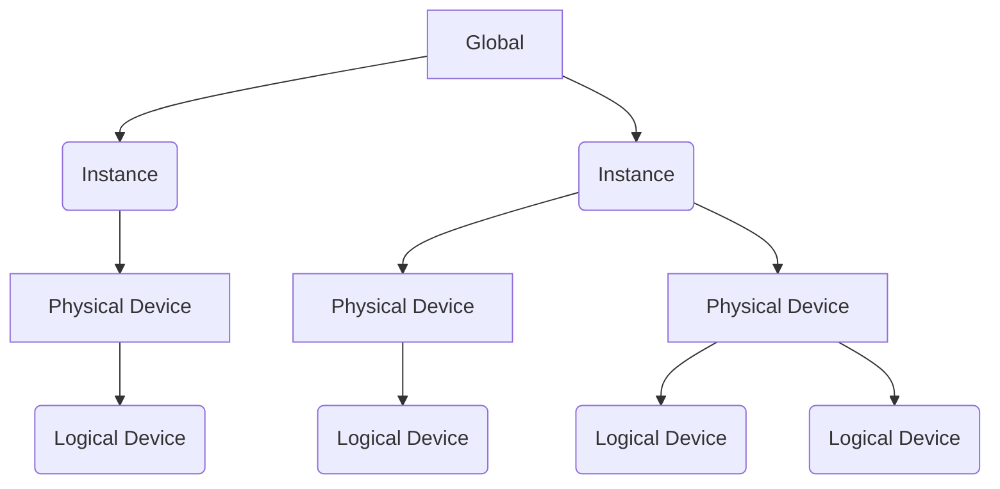
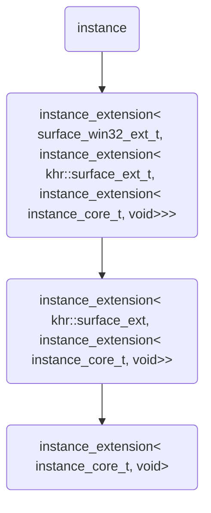

## 1. 前言
Vulkan作为OpenGL的继任者，解决了不少历史问题。例如Direct State Access取代State Machine，Validation Layers提供调式切面，轻量级的驱动并提供Core API和扩展等等。文本将浅讨vulkan loader，并结合modern C++设计和实践一个类型安全的接口封装方案。

## 2. Vulkan Loader
Vulkan是分层设计的API，并且还支持多个GPU和多个图形驱动程序。Vulkan Loader的一个重要的作用，就是把用户对Vulkan API的调用分发到不同的ICDs(Install CLient Drivers). 

Vulkan Loader是根据Object Model作为context来决定如何分发的。Explicit是Vulkan API的设计原则之一，所有的Vulkan API接口的第一个参数，都是Object Model的对象，例如Device，Queue和CommandBuffer等。对用户层，Vulkan提供Handler来索引这些对象，而内部则是一个指向结构体的指针，这个指针就包含了一个分发表，指向适用于该Vulkan Object的函数指针。

Vulkan Loader包含在Vulkan的SDK里面。在windows平台下名为vulkan-1.dll，当然不同的平台，还有API版本的演进这个名字会有所不同。使用Vulkan Loader的方式有两种:

1. 直接使用vulkan.h已经定义好的函数prototypes，静态地加载Vulkan Loader
2. 使用宏VK_NO_PROTOTYPES来禁用vulkan.h中的函数prototypes，并使用vkGetInstanceProcAddr或者vkGetDeviceProcAddr手动加载Vulkan Loader中的函数

第一种方法使用起来很简单，但是会有额外的运行期开销。由于静态加载地函数是全局的函数，并没有与特定的Object关联，所以全局函数还需要做一次间接地重定向。第二种方式虽然看似复杂，但是我们是对Object显式地加载API的函数，能够消除这个重定向。并且第二种方法更符合Vulkan的架构设计。

## 3. Global，Instance & Device 层级的API函数
Vulkan API有三个层级的API接口

* Global层级
* Instance层级
* Device层级

Global层级的接口主要负责创建Vulkan Instance实例，查询Layers和Extentions的一些信息。Instance层级的接口主要负责Device的创建，包括Physical Device的枚举，提供属性,特性和扩展的数据查询还有创建Logical Device。而Device层级的接口，负责处理所有的Object Model.

Global和Instance层级的接口，都要通过vkGetInstanceProcAddr加载，不同是Instance层级需要制定VkInstance的Handler. 而vkGetInstanceProcAddr这个函数我们可以通过boost::dll来导出。

```cpp
boost::dll::shared_library shared_lib { 
    "vulkan-1.dll", boost::dll::load_mode::search_system_folders };
shared_lib.get<std::remove_pointer_t<PFN_vkGetInstanceProcAddr>>(
    "vkGetInstanceProcAddr"
);
```

Device层级的接口通过vkGetDeviceProcAddr来获取，而这个函数本身是通过vkGetInstanceProcAddr函数获得的。

因此，在实践第二种方法，Instance和Device的实例关系会以如下结构呈现。


可以看出Vulkan的设计确实是完美兼顾了多卡多驱动。但是它并没有以直接的形式展现出这种模式，而是以Instance，Physical Device和Logical Device的这种实例层级关系来表达。虽然Vulkan的设计如是，但是在绝大多数的工程实践中，仅仅只会用最左边子树的模式来使用Vulkan.

而vulkan.h中的函数prototypes不再是全局函数，而是Global，Instance和Device实例的成员函数。

## 4. 扩展与接口生成
Vulkan的core API比OpenGL小了很多，甚至不包含任何present的接口。而平台相关的功能，和各大硬件或驱动厂商独特的功能都是以扩展的形式，按照统一的形式提供给用户使用。例如使用core和KHR扩展以及Win32KHR扩展，就可以让用户在windows平台上完成大部分的需求。

本文将要实现的Instance接口，只能看到我们所启用的Extension接口，而看不到程序没有启用的。这样可以避免调用未启用扩展的函数的错误。那么需求可以归纳如下:

* 封装VkInstance;
* 列出Instance需要的若干个扩展接口;
* 合成一个Instance类型，包含提供的扩展接口和VkInstance，作为VkInstance的封装类。

除此之外，我们还希望所有的这些扩展接口可以方便地访问到VkInstance的实例。很自然地，可以想到这个合成的类型，应该是一个单继承的结构。

为了实现单继承的结构，我们需要如下的类模板：

```cpp
template <typename Ext, typename Base>
class instance_extension;
```

接下来，实现core interface，这个是vulkan instance最基础的接口，它也是VkInstance的持有者。

```cpp
// tag class
struct instance_core_t {};

// core interface
template <>
class instance_extension<instance_core_t, void>
{
public:
    instance_extension(global_t const& global, VKInstance instance)
        : instance_(instance)
    {
        global.get_proc(instance, "vkDestroyInstance", vkDestroyInstance);
        global.get_proc(instance, "vkEnumeratePhysicalDevices", vkEnumeratePhysicalDevices);
        global.get_proc(instance, "vkCreateDevice", vkCreateDevice);        
    }

    ~instance_extension()
    {
        if (nullptr != instance_)
            vkDestroyInstance(instance_, nullptr);
    }

    auto enumerate_physical_devices() const
    {
        uint32_t device_count;
        vkEnumeratePhysicalDevices(instance_, &device_count, nullptr);
        std::vector<VkPhysicalDevice> physical_devices{ device_count };
        vkEnumeratePhysicalDevices(instance_, &device_count, physical_devices.data());
        return physical_devices;
    }
    // ... omitted interfaces

protected:
    VkInstance get_instance() const noexcept
    {
        return instance_;
    }

protected:
    VkInstance                      instance_;
    PFN_vkDestroyInstance           vkDestroyInstance;
    PFN_vkEnumeratePhysicalDevices  vkEnumeratePhysicalDevices;
    PFN_vkCreateDevice              vkCreateDevice;
    // ... omitted instance level functions
};

```

对instance level functions也需要做一些简单的封装，而不是暴露C接口函数，例如enumerate_physical_devices. 封装的任务是提供一个更接近对象语义的接口。此外，core interface还要暴露一个保护类型的接口，get_intance, 以便扩展接口可以方便的访问VkInstance. 篇幅所限，本文只列出了部分函数和一个接口封装的实现。

接下来是扩展接口。扩展接口还要承接继承关系，最后的基类是core interface。以VK_KHR_surface扩展为例：

```cpp
// tag class
namespace khr
{
    inline constexpr struct surface_ext_t
    {
        static char const* name() noexcept
        {
            return VK_KHR_SURFACE_EXTENSION_NAME;
        }
    } surface_ext;
}

// inheritance here
template <typename Base>
class instance_extension<khr::surface_ext_t, Base> : public Base
{
public:
    instance_extension(global_t const& g, VkInstance ins)
        : Base(g, ins)
    {
        assert(this->get_instance() == ins);
        g.get_proc(ins, "vkGetPhysicalDeviceSurfaceSupportKHR", vkGetPhysicalDeviceSurfaceSupportKHR);
        g.get_proc(ins, "vkGetPhysicalDeviceSurfaceCapabilitiesKHR", vkGetPhysicalDeviceSurfaceCapabilitiesKHR);
        g.get_proc(ins, "vkGetPhysicalDeviceSurfacePresentModesKHR", vkGetPhysicalDeviceSurfacePresentModesKHR);
        g.get_proc(ins, "vkDestroySurfaceKHR", vkDestroySurfaceKHR);
        g.get_proc(ins, "vkGetPhysicalDeviceSurfaceFormatsKHR", vkGetPhysicalDeviceSurfaceFormatsKHR);
    }

    void destroy_surface(khr::surface_t s) const
    {
        destory_surface(s.get());
    }
    // ... omitted interfaces

protected:
    void destory_surface(VkSurfaceKHR surface) const
    {
        if (nullptr != surface)
            vkDestroySurfaceKHR(this->get_instance(), surface, nullptr);
    }

protected:
    PFN_vkGetPhysicalDeviceSurfaceSupportKHR        vkGetPhysicalDeviceSurfaceSupportKHR;
    PFN_vkGetPhysicalDeviceSurfaceCapabilitiesKHR   vkGetPhysicalDeviceSurfaceCapabilitiesKHR ;
    PFN_vkGetPhysicalDeviceSurfacePresentModesKHR   vkGetPhysicalDeviceSurfacePresentModesKHR;
    PFN_vkDestroySurfaceKHR                         vkDestroySurfaceKHR;
    PFN_vkGetPhysicalDeviceSurfaceFormatsKHR        vkGetPhysicalDeviceSurfaceFormatsKHR;
};
```
单继承的结构无论是在内存的布局上还是接口的简洁性上都有很多优势，多继承的情况下要么使用type cast移动指针来尝试获取数据字段，要么对数据进行多份复制。以上面的代码作为扩展实现的蓝本，其他扩展的实现就是工作量的问题了。最后剩下一个将这些散列的扩展模板，与core interface链接的问题了。

链接扩展与core interface为一个聚合类，是一个类型计算的元函数，命名为generate_extensions_hierarchy, 先看看它的外观
```cpp
template 
<
    template <typename, typename> class TE,
    typename ... Exts
>
struct generate_extensions_hierarchy;
```
第一个参数是一个模板的模板参数(template template parameter), 它是生成单继承链的中间环，也就是我们的instance_extension模板。Exts就是我们要启用的扩展。元函数是一个递归模板，它的终止条件就是Exts的variadic size为1的时候，萃取T为扩展应用到TE模板，第二个参数为void. 终止条件肯定为core interface.
```cpp
template
<
    template <typename, typename> class TE,
    typename T
>
struct generate_extensions_hierarchy<TE, T>
{
    using type = TE<T, void>;
};
``` 
而它的递推式是萃取Exts...的第一个类型为扩展类型应用于TE模板。然后再继续利用元函数，递归推导余下的扩展类型，作为第二个模板参数，对应于instance_extension的Base参数，也就是基类。
```cpp
template 
<
    template <typename, typename> class TE,
    typename T, typename ... Rests
>
struct generate_extensions_hierarchy<TE, T, Rests...>
{
    using type = TE<T, typename generate_extensions_hierarchy<TE, Rests...>::type>;
};
```
最后我们的instance类，可以这样实现：
```cpp
template
<
    template <typename, typename> class TE,
    typename ... Exts
>
using generate_extensions_hierarchy_t = typename generate_extensions_hierarchy<TE, Exts...>::type;

template <typename T, typename Base>
using instance_extension_alias = instance_extension<T, Base>;

template <typename ... Exts>
class instance : public 
    generate_extensions_hierarchy_t<instance_extension_alias, Exts..., instance_core_t>
{
public:
    // implementation omitted
};
```
可以看到，core interface是扩展列表的最后一个，这里保证了它是终止条件。假设我们现在已经实现完毕了VK_KHR_surface和VK_KHR_win32_surface两个扩展，那么创建instance的简化代码如下：
```cpp
class global_t
{
public:
    // ... omitted interface
    template <typename PFN>
    void get_proc(VkInstance instance, char const* name, PFN*& )

    template <typename ... Exts>
    auto create_instance(Exts ...)
    {
        return instance<Exts>{ *this, create_instance_handle()  };
    }

private:
    VkInstance create_instance_handle();

private:
    PFN_vkGetInstanceProcAddr   vkGetInstanceProcAddr;
    PFN_vkCreateInstance        vkCreateInstance;
};

auto& g = global_t::get();
auto instance = g.create_instance(khr::surface_win32_ext, khr::surface_ext);
```
下图显示了生成instance类的继承图表


## 5.小结
使用接口生成合成类，生成类型安全的接口，可以让我们避免调用为启用扩展的函数的错误。在Vulkan API的封装的实际应用中，不仅可以避免前面提到的错误，还可以在避免全局函数间接调用ICDs所带来的性能损失，同时也更符合vulkan中的概念. 本文中的详细代码可以参照[这里](https://github.com/Madokakaroto/vulkancpp), 目前只完成了Instance的封装，后续的实验性工作会继续进行。也欢迎来purecpp社区吐槽和交流。QQ群号：296561497.